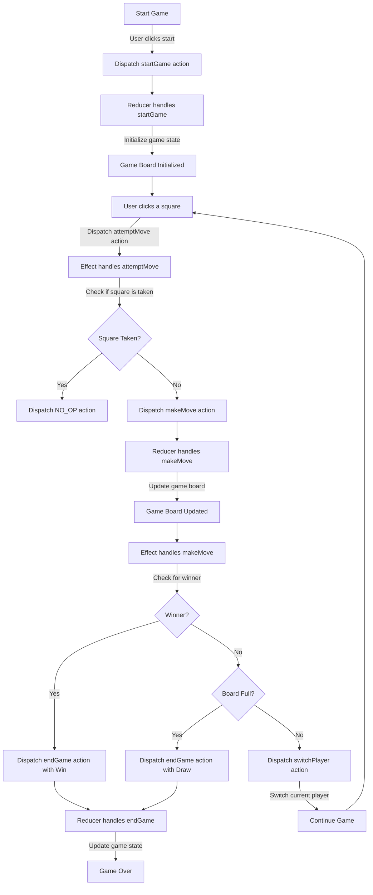

```mermaid
graph TD
    A[Start Game] -->|User clicks start| B[Dispatch startGame action]
    B --> C[Reducer handles startGame]
    C -->|Initialize game state| D[Game Board Initialized]
    D --> E[User clicks a square]
    E -->|Dispatch attemptMove action| F[Effect handles attemptMove]
    F -->|Check if square is taken| G{Square Taken?}
    G -->|Yes| H[Dispatch NO_OP action]
    G -->|No| I[Dispatch makeMove action]
    I --> J[Reducer handles makeMove]
    J -->|Update game board| K[Game Board Updated]
    K --> L[Effect handles makeMove]
    L -->|Check for winner| M{Winner?}
    M -->|Yes| N[Dispatch endGame action with Win]
    M -->|No| O{Board Full?}
    O -->|Yes| P[Dispatch endGame action with Draw]
    O -->|No| Q[Dispatch switchPlayer action]
    N --> R[Reducer handles endGame]
    P --> R
    R -->|Update game state| S[Game Over]
    Q -->|Switch current player| T[Continue Game]
    T --> E
```
